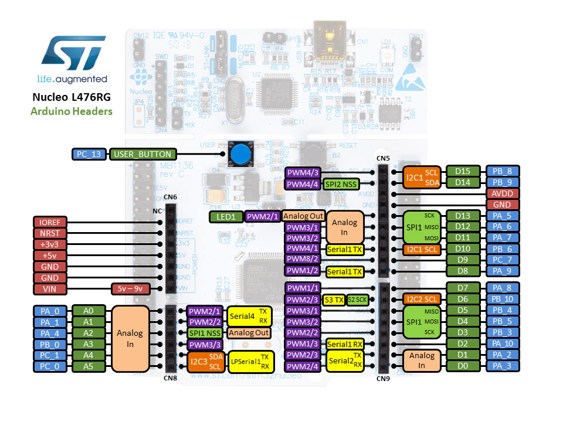

# The-Udder-Project

## Pinout

| Function | Chip pinout | Board pinout |
| :---: | :---: | :---: |
| Magnet control | PB4 | D5 |
| Position control| PC1 | A4 |
| Gripper encoder CHA | PA6 | D12 |
| Gripper encoder CHB | PA7 | D11 |
| Motor encoder CHA | PA8 | D7 |
| Motor encoder CHB | PA9 | D8 |
| Magnet on | PB6 | D10 |
| Magnet off | PC7 | D9 |
| Position left | PA0 | A0 |
| Position right | PA1 | A1 |

## Threads
1. Receiving the position signal (analog) and magnet signal (digital), read data from motor encoder and gripper encoder  
   Excute at 100Hz
2. Control and actuate the magnet and pnuematic motor (4 solenoids)  
   Excute until reach the reference
